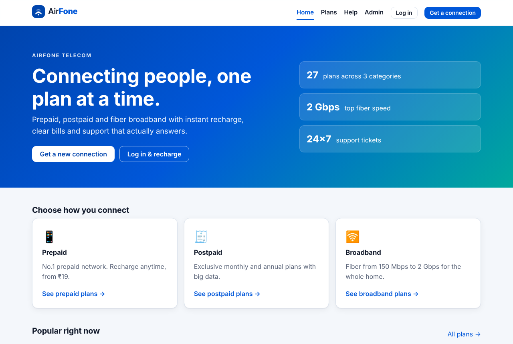
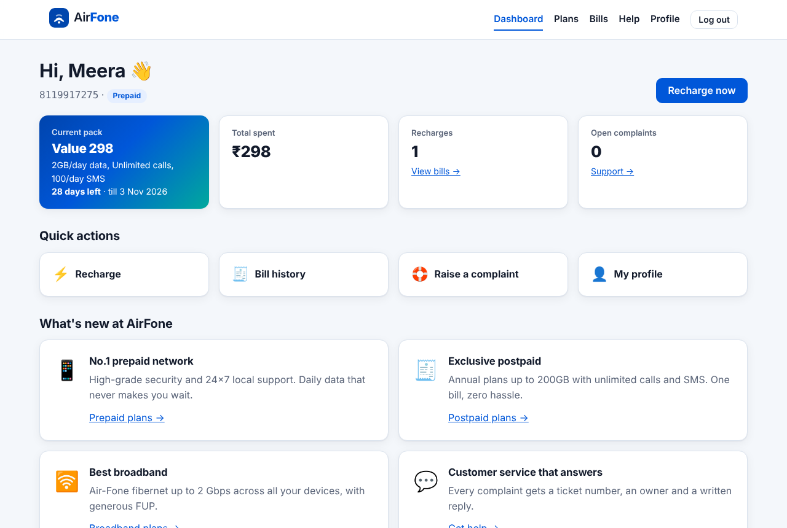
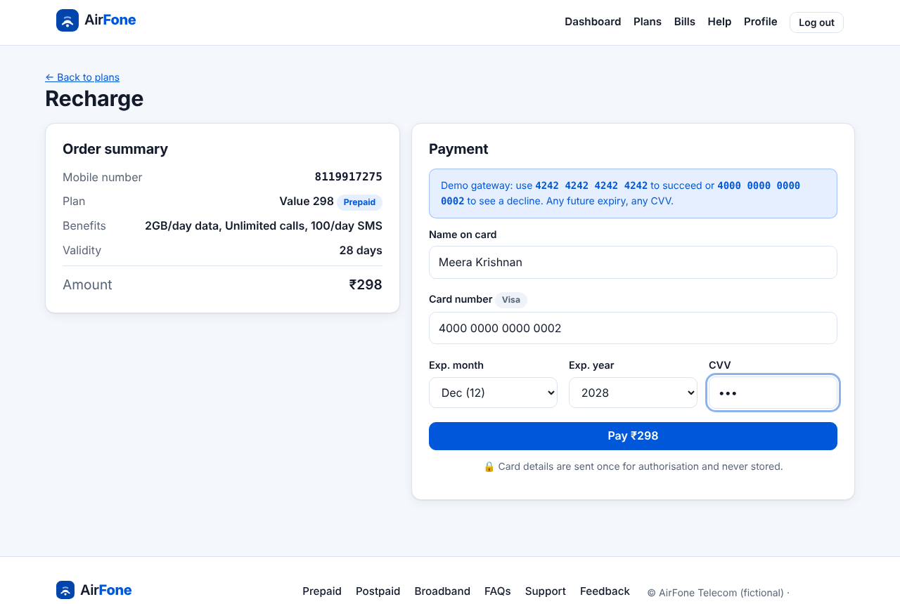
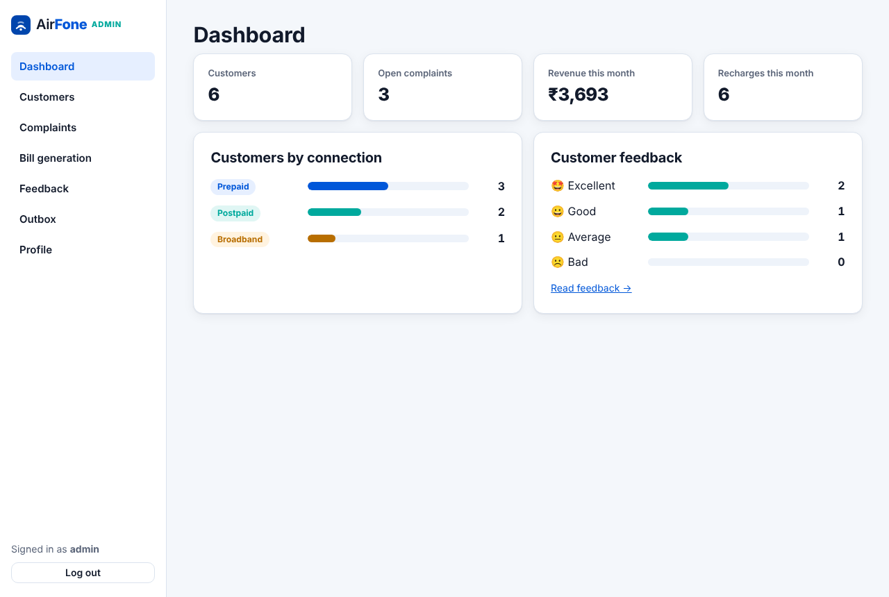
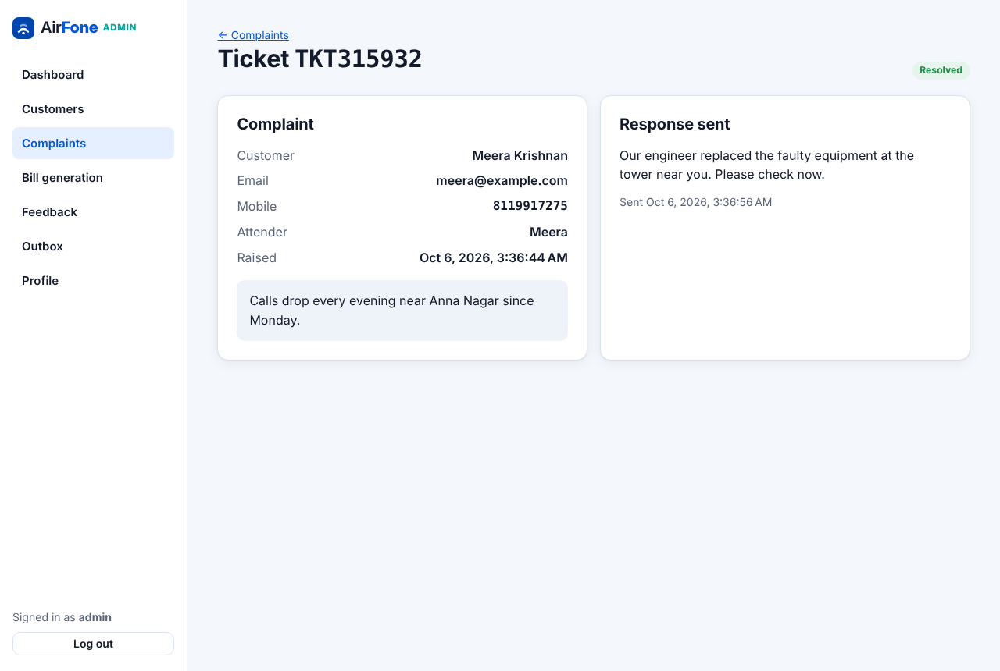
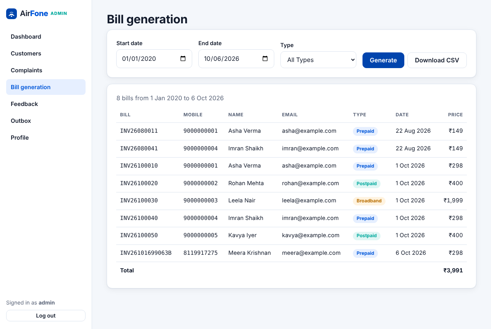

# AirFone: Telecom Self-Service Portal

[](https://github.com/imkarthiknr/AirFone/actions/workflows/ci.yml)


AirFone is a fictional mobile network operator. This repository is its **customer portal and admin console**. Customers get a mobile number, recharge prepaid, postpaid or broadband plans, see their bills and raise complaints. Admins manage customers, answer complaints and generate billing reports.

It began as our **Team-4 final project in August 2020** (Angular 10, two Flask services, MySQL). In 2026 it was rebuilt to feature parity with a modern, secure and tested stack. See [What changed from 2020](#what-changed-from-2020) and the [CHANGELOG](CHANGELOG.md).

| Home | Dashboard | Recharge |
| --- | --- | --- |
|  |  |  |
| **Admin dashboard** | **Complaint response** | **Bill generation** |
|  |  |  |

More screenshots are in [docs/screenshots](docs/screenshots).

## Features

**Customers**
- **Plans:** 27 prepaid, postpaid and broadband plans, browsable by category.
- **New connection:** registration with validation (including the Aadhaar checksum and an 18+ age check). A unique 10-digit mobile number is allocated and e-mailed.
- **Login** by mobile number. **Forgot password** sends a one-time reset link that expires after 30 minutes.
- **Recharge** through a mock card gateway (Luhn check, expiry and CVV rules, test cards for approve and decline). Plans must match the connection type.
- **Dashboard** with the current pack, days left, total spent and open complaints. **Bill history** has printable invoices.
- **Support:** raise complaints, see the assigned agent and read admin replies. **Feedback** with a satisfaction rating.
- **Profile:** edit details, change password, and read the inbox of e-mails and SMS sent to you.

**Admins**
- **Dashboard:** customers by type, open complaints, monthly revenue and recharges, feedback breakdown.
- **Customers:** search and filter, update name, connection type and active status, send a reset link, delete.
- **Complaints:** filter open or resolved, reply by e-mail and resolve in one step.
- **Bill generation:** bills by date range and type, with totals and CSV export.
- **Feedback** list, **outbox** of every e-mail and SMS sent, and an **admin profile** page.

## Architecture

```
 Browser ──▶ web (nginx) ── /api/* ──▶ api (FastAPI) ──▶ MySQL 8
             Angular 21 SPA            routes → services → SQLAlchemy 2
                                       │
                                       └─▶ notifications outbox ──(optional SMTP)──▶ e-mail
```

| Layer | Tech | Notes |
| --- | --- | --- |
| **web/** | Angular 21 (standalone, signals, zoneless), RxJS, reactive forms | Lazy routes, JWT interceptor, customer/admin route guards, accessible forms |
| **api/** | FastAPI, SQLAlchemy 2, Alembic, Pydantic v2, bcrypt, PyJWT | One service with separate customer and admin roles. It replaces the original two Flask apps on ports 4003 and 4004 |
| **db** | MySQL 8.4 (Docker), SQLite (local dev and tests) | Schema managed by migrations. Plans seeded from the original 2020 catalogue |

## Quick start

### Docker (MySQL + API + web)

```bash
git clone https://github.com/imkarthiknr/AirFone.git
cd AirFone
docker compose up --build
```

Open <http://localhost:8080>.

| Role | Login | Password |
| --- | --- | --- |
| Customer (prepaid) | `9000000001` | `airfone123` |
| Customer (postpaid / broadband) | `9000000002` / `9000000003` | `airfone123` |
| Admin | `admin` at `/admin/login` | `admin12345` |

**Test cards:** `4242 4242 4242 4242` is approved and `4000 0000 0000 0002` is declined. Use any future expiry date and any CVV. All demo people and data are fictional.

### Local development

You need Node 20.19+/22.12+/24, Python 3.11+ and [uv](https://docs.astral.sh/uv/).

```bash
npm install          # root tooling
npm run setup        # API deps + SQLite schema + demo data, web deps
npm run dev          # API on :8000, web on :4200 (proxied)
```

## Project structure

```
AirFone/
├── api/                     FastAPI service
│   ├── app/
│   │   ├── api/routes/      auth, plans, me (customer), feedback, admin
│   │   ├── services/        customers, billing, payments (mock), support, admin, notifications
│   │   ├── core/            settings, security (bcrypt/JWT), validators (Verhoeff, Luhn)
│   │   ├── models.py        SQLAlchemy models
│   │   ├── schemas.py       Pydantic request/response models
│   │   └── seed.py          plan catalogue, first admin, demo data
│   ├── migrations/          Alembic
│   └── tests/               pytest (SQLite + MySQL)
├── web/                     Angular app
│   ├── src/app/
│   │   ├── core/            models, auth (service, interceptor, guards), API services
│   │   ├── layout/          public and admin shells
│   │   ├── shared/          plan card, field errors, validators, logo
│   │   └── pages/           public/, customer/, admin/
│   └── e2e/                 Playwright journeys
├── docs/
│   ├── project/             original 2020 documentation, slides, test cases, demo video
│   └── screenshots/
├── docker-compose.yml
└── DEVELOPMENT.md
```

## Testing

| Suite | Command | Count |
| --- | --- | --- |
| API (pytest, SQLite; also run on MySQL in CI) | `cd api && uv run pytest` | 41 |
| Web unit (Vitest) | `cd web && npm test` | 20 |
| End-to-end (Playwright, real API + web) | `cd web && npm run e2e` | 4 journeys |

CI also checks migrations against MySQL and builds the Docker stack, then smoke-tests it through nginx.

## What changed from 2020

| 2020 | 2026 |
| --- | --- |
| Angular 10, NgModules, `alert()` popups, hard-coded `127.0.0.1:4003/4004` URLs | Angular 21 standalone and signals, inline validation, relative `/api` behind a proxy |
| Two Flask apps, SQL built by string concatenation (SQL injection) | One FastAPI service, ORM with parameterised queries |
| Plain-text passwords. "Forgot password" e-mailed the password | bcrypt hashes. One-time, expiring reset links |
| An unauthenticated endpoint returned every admin's username and password. No route or API access control | JWT auth on every customer and admin endpoint, separate roles, and route guards in the UI |
| Full card number and CVV stored in `paymenthistory` | Mock gateway. Only brand and last four digits are stored |
| Full Aadhaar number stored | Checksum-validated, only the last four digits kept |
| Gmail passwords and an SMS API key in the source code | No secrets in code. Messages go to an outbox, with optional SMTP via environment variables |
| Real people's details in the SQL seed | Fictional demo data only |
| No tests, no build automation | pytest, Vitest, Playwright, Docker, GitHub Actions |

> **Note:** commits made before the 2026 rebuild still contain credentials and personal data in their history. Those credentials should be treated as compromised and rotated. The current tree contains none of it.

## The original team (2020)

AirFone was designed and built by **Team-4**: **Karthik N R**, **Roshan Sharma**, **Rupika G**, **Hayath Masthan** and **Jeethendra Kumar C**. The original documentation, BRS slides, module breakdown, test cases and demo video are kept in [`docs/project/`](docs/project). Hayath's admin-module work is still on the [`hayath`](https://github.com/imkarthiknr/AirFone/tree/hayath) branch.

## License

The code in this repository is [MIT](LICENSE) licensed. The materials in `docs/project/` are the original Team-4 project documents and are included for reference.
